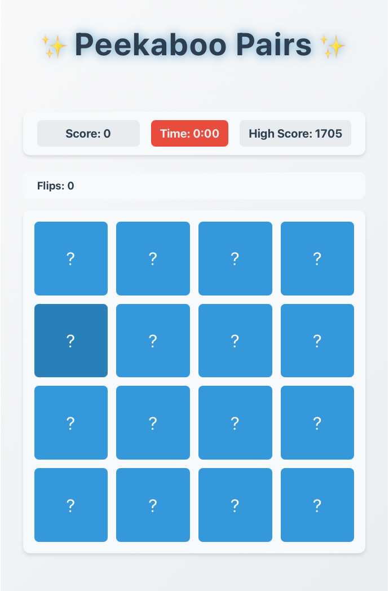
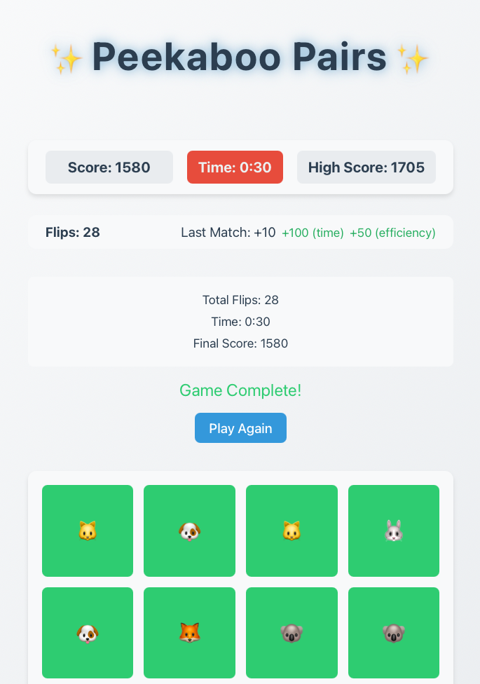

A fun project to learn front end web development by a backend developer.
Motivation was to develop something that my kid enjoys playing.

URL of the game: [Peekaboo Pairs](https://dev.d25jskoji0j0wl.amplifyapp.com)

Instructions to run the game locally:
```
$ npm install

$ npm run dev
```
Should be available to play at http://localhost:5173


## Services used for development
- **Amazon Q** as part of VS Code for ideation, design & development
- **Amazon Amplify** to host the game
- **Amazon DynamoDB** to store highest score

## Backstory
When I came across [**AWS Game Builder Challenge**](https://awsdevchallenge.devpost.com), I had multiple goals in mind with this, with the obvious being the prize money, the more realistic one being -  see how far I can get to with the latest stack of front end technologies in developing a complete solution. I have been a backend developer for my entire engineering career working on C, C++, Python, Perl, Ruby. My indulgence in front end development is minimal and probably a decade old tinkering something with jQuery and primitive HTML, CSS.
The other tangetial goal I had is to develop something that my kid has fun playing with.

My initial attempt for is a multi-player board game, spent few days on it, even though I am using the Code generation tools like **Amazon Q, ChatGPT, Google AI Studio** the sorts of problems I am encountering weren't easy to solve, I was not able to get to a workable solution with help of online documentation and LLMs, I realized it would require lot more domain expertise to proceed further with that, which I don't have at the moment, so I gave up on this challenge.

With 4 days left in the competition, I didn't want to feel defeated in this, so I came back to Amazon Q this time right from the beginning in terms of what game that I could try for this and picking a simpler game which has minimal components and I went more methodical with this one, starting with minimal skeleton and slowly adding features with increasing complexity, so that I can debug and potential fix thigns on the way. Fortunately, this approach worked, I am **amazed** at LLMs(in this specific scenario with **Amazon Q**) capability to writing code that helps in full end to end development.

## Amazon Q Usage
There are **960 lines of code** including all the files in the src and few configuration files at the root level.
All these lines except **7 lines**(in [src/styles/GameBoard.css](src/styles/GameBoard.css)) including comments 😀 were generated by **Amazon Q**, all I had to do was click `Insert At Cursor` of the generated code in the right file.

A full chat history of prompts and responses captured at [docs/amazon-q-full-chat.md](docs/amazon-q-full-chat.md) for the curious.
I wish I had an easier way to capture the marked down response generated in the chat window. Also included some images captured of the prompts and responses in [docs](docs/).

I am quite surprised on how far I was able to go with the Amazon Q IDE integrated Chat plugin, highlighting some of the aspects of the **Amazon Q** usage below:
- Ideation
  - [Generate some game ideas](docs/amazon-q-full-chat.md#prompt-ideation)
  - [Changing the title of the game](docs/amazon-q-full-chat.md#prompt-title-change)
  - [License generation](docs/amazon-q-full-chat.md#prompt-license)
  - ...
- Design code structure / architecture
  - [Generate the high level code structure](docs/amazon-q-full-chat.md#prompt-architecture)
  - ...
- Code Generation (Javascript, React, Vite, HTML, CSS)
  - [First iteration of code](docs/amazon-q-full-chat.md#prompt-architecture)
  - [Addition of DynamoDB to track high score](docs/amazon-q-full-chat.md#prompt-dynamodb)
  - ...
- Iteration
  - [Generate code for testing what I had so far](docs/amazon-q-full-chat.md#prompt-iteration)
  - [CSS work for night mode](docs/amazon-q-full-chat.md#prompt-night-mode-style)
  - [Addition of time factor to the game](docs/amazon-q-full-chat.md#prompt-add-time)
  - [Addition of flips tracking](docs/amazon-q-full-chat.md#prompt-add-flips)
  - ...
- Configuration generation
  - [Permissions needed for DynamoDb access](docs/amazon-q-full-chat.md#prompt-dynamodb-access)
  - ...
- Debugging and fixing errors
  - [Figuring out why scores are not being updated in DynamoDB](docs/amazon-q-full-chat.md#prompt-debug-score-update)
  - [Command line syntax fix](docs/amazon-q-full-chat.md#prompt-debug-syntax)
  - [Failure during amplify publish](docs/amazon-q-full-chat.md#prompt-debug-amplify)
  - ...
- Suggestions on improvements and enhancements.
  - After almost all code generation steps, at the end of response there are some suggestions on what steps to work on next or how to improve the current step I am working on.


## Todos
- Write tests
- Refactor the code with better organization
- Add more interesting features
  - Personalized score with user tracking
  - Introduce more categories for the game rather than just animal emojis
  - Add different levels of difficulty
    - Bigger board
    - Varying background colors for the cards

## Images of the game




